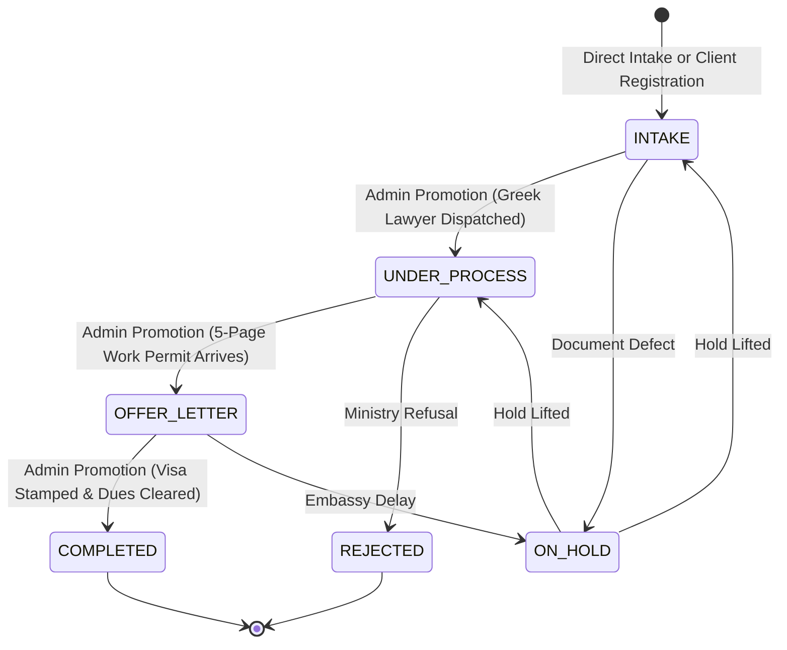

# 📋 Client Requirements Audit, Technical Diagnostics & Implementation Blueprint

**Client Organization:** Monsur Ali Travels  
**Domain:** Manpower Export, Overseas Employment, Visa Processing & Travel Agency (Bangladesh to Greece, Balkans, Middle East)  
**Document Type:** Master Operational Audit, Codebase Defect Analysis & Architectural Blueprint  
**Version:** 2.0.0  
**Date:** September 06, 2026  
**Auditing Subagent Panel:**  
1. Senior Business Analyst & Domain Solution Architect  
2. Client Success Director & User Experience Strategist  
3. Fullstack Team Lead  
4. Enterprise Chief Technology Officer (CTO)  

---

## 📑 Table of Contents
1. [Executive Summary & The Voice of the Client](#1-executive-summary--the-voice-of-the-client)
2. [Business Analyst Report: Operational Workflows & Requirements](#2-business-analyst-report-operational-workflows--requirements)
   - 2.1 Domain Context & Operational Reality
   - 2.2 As-Is vs. To-Be Workflow Architecture
   - 2.3 Gherkin User Stories & Acceptance Criteria
   - 2.4 Data Contracts per Stage
3. [Client Success & UX Report: Restoring Trust & Adoption](#3-client-success--ux-report-restoring-trust--adoption)
   - 3.1 Psychological & Operational Friction Audit
   - 3.2 Eliminating the "Lost File" Panic (100% Visual Reassurance)
   - 3.3 Solving the Bangladeshi Name Collision Crisis (Ali Noor, Islam Uddin)
   - 3.4 Staff Task vs. Admin Authority Safeguards
4. [Fullstack Technical Audit: Codebase Root-Cause Diagnostics](#4-fullstack-technical-audit-codebase-root-cause-diagnostics)
   - 4.1 Root Cause of the "Missing 7 Files" in Offer Letter
   - 4.2 Enum Desynchronization & Filter Mismatches
   - 4.3 The Document Vault Ingestion Trap
   - 4.4 Rigid Creation Defaults & Query Limits
   - 4.5 Repository Design System & Universal Modal Standard
5. [CTO Architectural Blueprint: State Machine & System Strategy](#5-cto-architectural-blueprint-state-machine--system-strategy)
   - 5.1 Three-Layer Decoupled State Machine Architecture
   - 5.2 Server-Side RBAC & Invariant Enforcement
   - 5.3 Document Storage (Cloudflare R2) & Reversal of 180-Day Deletion Bug
   - 5.4 Hybrid AI/OCR Passport Data Extraction Architecture
   - 5.5 200-File Backlog Ingestion & Migration Engine
6. [Consolidated Action Plan & Phased Engineering Roadmap](#6-consolidated-action-plan--phased-engineering-roadmap)

---

## 1. Executive Summary & The Voice of the Client

In a recent executive briefing, the proprietor of **Monsur Ali Travels** expressed acute anxiety, confusion, and operational paralysis caused by the ERP software:

> *"আমার যেমন যেহেতু আমি পাসপোর্ট নিয়ে কাজ করি। তো আমার ওই যে হিসাব রাখাটা অনেক বড় সমস্যা হচ্ছে গিয়া যে ওয়ার্ক পারমিট আন্ডার প্রসেস, ওয়ার্ক পারমিট এগ্রিবল, ওয়ার্ক পারমিট অফার লেটার কমপ্লিট। তো ওইখানে দেখা যাচ্ছে যে ফাইল আপলোড করলে এক জায়গায় যাচ্ছে সবগুলা... আর আবার ওই যে এক্রিভল লেটার এক্রিভল দিলে তো ওইখানে মানে হচ্ছে না ভাই..."*

> *"আমি অনেক সময় দেখছি আমি যদি ১০ টা ফাইল সাবমিট করি পরবর্তীতে অফার লেটারে গেলে দেখা যাচ্ছে তিনটাও দেখায় না। ওইরকমও হয় ঠিক আছে? এটা আসলে আমারে বেশি জ্বালাইতেছে আরকি আমি কাজ করতে পারতেছি না।"*

> *"আমি দিছি না দিছি না কনফিউশন আছে না এরকম? সেই ফাইলটারে খুঁজতে খুঁজতে তো আমার জীবন নষ্ট হয়ে যাবে..."*

> *"এক নামে ১০-১৫ টা হয়ে যায়... আমাদের তো মনে করেন আলী নূর, ইসলাম উদ্দিন অনেক বেশি। ওইখানে মেইন প্রবলেমটা হচ্ছে গিয়ে আমি ওই কনফিউশন ওইখানেই করি। পাসপোর্ট আপলোড করার জায়গাটা যদি একই সাথে থাকতো, সাথে সাথে পাসপোর্টটা এসে যেত..."*

> *"আমার কাছে ২০০ ফাইল আছে যেগুলো আমি সফটওয়্যারে ঢুকাব... আজকে ৩টা অফার লেটার বাইর হইছে ৫ পেইজের... আমি তো আগের স্টেপ ঘুরে আসতে পারব না, সরাসরি অফার লেটার স্টেজে আপলোড দেওয়ার অপশন লাগবে..."*

### The Core Synthesis of the Client's Pain:
1. **The Phantom File Problem (Critical Trust Deficit):** Out of 10 files submitted, only 3 appear in the Offer Letter stage. The owner believes the software is deleting or losing client cases.
2. **Identity Blindness & Naming Collisions:** Common Bangladeshi names (*Islam Uddin*, *Ali Noor*) make text-only listings dangerous. Without immediate visual passport confirmation, files risk getting mixed up.
3. **Workflow Suffocation (200-File Backlog):** The agency has ~200 active files and receives 5-page Greek work permits daily. Rigid, sequential stage gating prevents them from directly entering files that are already at the Offer Letter stage.
4. **Boundary Confusion between Staff and Master Stage:** When subordinate staff (e.g., Hakimul Islam) complete clerical tasks, the owner fears staff will inadvertently alter the client's official visa stage.
5. **Over-Engineered Stages:** The agency's mental model operates on **3 Core Operational Stages + Completed**:
   - **Stage 1:** File Intake (নতুন ক্লায়েন্ট / ইনটেক)
   - **Stage 2:** Under Process (আন্ডার প্রসেস)
   - **Stage 3:** Offer Letter / Approval (অফার লেটার / ওয়ার্ক পারমিট)
   - **Stage 4:** Completed & Delivered (কমপ্লিট / ডেলিভারি)
   *(With Indian Visa transit processing strictly isolated).*

---

## 2. Business Analyst Report: Operational Workflows & Requirements

### 2.1 Domain Context & Operational Reality
Monsur Ali Travels specializes in long-cycle European manpower recruitment (primarily **Greece agricultural/general work permits** taking 6–12 months, and **North Macedonia/Balkan deployment**). 
- Candidates pay in 3 milestones:
  - **Milestone 1 (Advance):** At intake upon physical passport deposit.
  - **Milestone 2 (Offer Approval):** Upon foreign government work permit / offer letter issuance.
  - **Milestone 3 (Final Delivery):** Upon visa stamping and passport handover.
- Candidates must execute a **300-Taka Non-Judicial Judicial Stamp Deed / Guarantor Affidavit** signed by a legal guardian.
- To travel to Greece from Bangladesh, candidates must transit through New Delhi, India for European Embassy biometrics, requiring an isolated **Indian Double-Entry Transit Visa** sub-pipeline.

### 2.2 As-Is vs. To-Be Workflow Architecture

```
┌─────────────────────────────────────────────────────────────────────────────┐
│                             AS-IS ARCHITECTURE                              │
│  [Client Intake] ──► [Step 1 Wizard] ──► [Step 2 Country] ──► [Step 3 Vault]│
│                                                                      │      │
│  [Assigned to Staff] ◄── [Mandatory Status = ENTRY] ◄────────────────┘      │
│         │                                                                   │
│         ▼                                                                   │
│  [Staff Completes Task] ──► [Overwrites workflowStatus] ──► [VANISHES!]     │
│                                                                             │
│  * Over-engineered 5 stages, no direct entry, files disappear.              │
└─────────────────────────────────────────────────────────────────────────────┘
                                      ▼
┌─────────────────────────────────────────────────────────────────────────────┐
│                             TO-BE ARCHITECTURE                              │
│                                                                             │
│  ┌───────────────────────────────────────────────────────────────────────┐  │
│  │                    UNIFIED INTAKE & IDENTITY MODAL                    │  │
│  │  1. Mandatory Passport Upload (PDF/Image) with Instant Live Preview   │  │
│  │  2. AI / MRZ Auto-fill (Name, Passport No, DOB, Expiry)              │  │
│  │  3. Guardian Guarantor Details (For 300-Tk Judicial Stamp Deed)       │  │
│  │  4. Target Stage Selector: [ Intake ] | [ Under Process ] | [ Offer ] │  │
│  └──────────────────────────────────┬────────────────────────────────────┘  │
│                                     │                                       │
│          ┌──────────────────────────┼──────────────────────────┐            │
│          ▼                          ▼                          ▼            │
│  ┌───────────────┐          ┌───────────────┐          ┌───────────────┐    │
│  │ 1. INTAKE     │          │ 2. PROCESSING │          │ 3. OFFER      │    │
│  │ Dedicated Tab │          │ Dedicated Tab │          │ Dedicated Tab │    │
│  │ Passport scan │          │ Greek Lawyer  │          │ 5-Page Permit │    │
│  │ Advance Recpt │          │ Ministry Subm │          │ Milestone 2   │    │
│  └───────┬───────┘          └───────┬───────┘          └───────┬───────┘    │
│          │                          │                          │            │
│          └──────────────────────────┼──────────────────────────┘            │
│                                     ▼                                       │
│                             ┌───────────────┐                               │
│                             │ 4. COMPLETED  │                               │
│                             │ Visa Stamped  │                               │
│                             │ Full Dues = 0 │                               │
│                             └───────────────┘                               │
│                                                                             │
│  * Strict Staff RBAC: Staff complete tasks; only Admin advances stages.     │
└─────────────────────────────────────────────────────────────────────────────┘
```

### 2.3 Gherkin User Stories & Acceptance Criteria

#### User Story 1: Mandatory Passport Upload on Screen 1
```gherkin
Feature: Mandatory Passport Upload on Client Creation
  As an Agency Owner
  I want passport upload to be mandatory on the initial screen
  So that no candidate file is ever created without verified identity documentation.

  Scenario: Creating file without passport
    Given the operator opens the "Create New Client File" modal
    When the operator enters name and phone but skips passport upload
    And clicks "Submit"
    Then the submission is blocked with error: "Passport scan is mandatory."

  Scenario: Uploading passport with instant preview
    Given the operator selects a valid passport PDF/image
    When upload completes
    Then the system displays an instant thumbnail and preview of the passport
    And enables the submission button.
```

#### User Story 2: Direct Backlog Ingestion (Offer Letter Fast-Track)
```gherkin
Feature: Direct Stage Ingestion for Backlog Files
  As an Agency Administrator
  I want to create a new file directly into the "Offer Letter / Approval" stage
  So that I can immediately ingest our 200 backlog files with 5-page approvals.

  Scenario: Direct ingestion into Offer Letter stage
    Given the Admin selects target stage "Offer Letter / Approval (Stage 3)"
    When the Admin attaches the mandatory passport scan
    And attaches the 5-page Greek Work Permit / Offer Letter PDF
    And clicks "Directly Onboard to Offer Letter Stage"
    Then the Case File is created with status = "OFFER_LETTER"
    And appears immediately in the "Offer Letter" dedicated table
    And is not forced through Step 1 or Step 2.
```

#### User Story 3: Staff Task Decoupling
```gherkin
Feature: Staff Task Execution Role Guard
  As an Agency Owner
  I want staff task submissions to never alter the master client stage
  So that file states remain 100% under executive control.

  Scenario: Staff completes assigned document check
    Given a Case File is at stage "OFFER_LETTER"
    And staff member "Hakimul" completes task "Upload Indian Visa Slip"
    When Hakimul marks the task as "DONE"
    Then the task status updates to "DONE"
    And the Case File master stage strictly remains "OFFER_LETTER"
    And the file remains visible in the Offer Letter table.
```

### 2.4 Data Contracts per Stage

| Stage | Mandatory Data Fields | Mandatory Documents | Secondary Tasks & Triggers |
|---|---|---|---|
| **1. File Intake** | `applicantName`, `passportNumber` (Unique, 9-char), `phone`, `fatherName`, `guardianName`, `guardianPhone`, `guardianRelationship`, `guardianNid`, `destinationCountry` | **Passport Bio-Page Scan** (PDF/Image, Cloudflare R2) | Step 1 Advance Payment receipt; generate 300-Tk Judicial Stamp Deed. |
| **2. Under Process** | `submissionTrackingNumber`, `lawyerName`, `processingDispatchedDate` | **Submission Acknowledgment / Lawyer Receipt** | Translation checklist, Police Clearance (PCC), ministry fee voucher. |
| **3. Offer Letter** | `offerApprovalDate`, `workPermitNumber`, `employerName`, `jobTrade` | **5-Page Work Permit / Offer Letter Dossier (PDF)** | Milestone 2 payment collection; Indian Transit Visa activation. |
| **4. Completed** | `visaNumber`, `visaIssueDate`, `visaExpiryDate`, `deliveryDate`, `deliveredToPersonName` | **Stamped Visa Scan** & **Signed Delivery Slip** | Final settlement (`dueAmount == 0`); archive file. |

---

## 3. Client Success & UX Report: Restoring Trust & Adoption

### 3.1 Psychological & Operational Friction Audit
The client's statement—*"খুঁজতে খুঁজতে তো আমার জীবন নষ্ট হয়ে যাবে"*—reflects high-stakes operational dread:
- In rural Bangladesh manpower recruiting, losing a candidate's file or misplacing an offer letter leads to **police intervention, village panchayat disputes, and reputational destruction**.
- The software was behaving unpredictably. The owner felt he was being gaslit by the system because files he knew were entered were not showing up.

### 3.2 Eliminating the "Lost File" Panic (100% Visual Reassurance)
1. **Persistent Master Dossier Counter:**
   - Display an immutable global status bar at the top of the application:
     `📁 Total Active Cases: 200 | 📥 Intake: 35 | ⚙️ Processing: 42 | 📜 Offer Letter: 48 | 🏛️ Embassy: 50 | ✈️ Delivered: 25`
   - *Key UX Rule:* Searching or filtering never removes this master counter. If a search matches 3 files, the counter reads: `"Showing 3 of 200 total active cases"`.
2. **Instant Creation Slip & Success Toast:**
   - On case creation, render an instant confirmation modal with client code and print button: `"✅ Case CLNT-10928 (Islam Uddin) registered under File Intake. Print Slip ➔"`.

### 3.3 Solving the Bangladeshi Name Collision Crisis (Ali Noor, Islam Uddin)
1. **Triad Identity Header on All Cards & Tables:**
   - **Photo Avatar:** 40×40px visual image from passport scan or photo.
   - **Bio String:** `Name` + `S/O Father Name` + `District`:  
     `Islam Uddin` *(S/O: Late Monir Uddin • Golapganj, Sylhet)*
   - **Monospace Passport Chip:** `[ 🛂 A02948192 ]` (bold uppercase font).
2. **1-Click Hover Passport Quick-Peek:**
   - Hovering over the `[ 🛂 Passport Chip ]` triggers an instant floating popover preview of the passport bio-page scan, allowing the owner to verify the candidate in 2 seconds without navigating away.

### 3.4 Staff Task vs. Admin Authority Safeguards
- **Client Portal Hardening:** Remove all stage advancement controls from `dashboard/client` ([`CaseWorkspaceDrawer.jsx`](file:///f:/Monsur%20Ali%20Travels/dashboard/src/client/components/agency/CaseWorkspaceDrawer.jsx)).
- Staff buttons are restricted to: `[ Upload Document ]`, `[ Issue Money Receipt ]`, `[ Submit Task for Review ]`.
- Only Admin and Owner accounts can advance the macro lifecycle stage.

---

## 4. Fullstack Technical Audit: Codebase Root-Cause Diagnostics

### 4.1 Root Cause of the "Missing 7 Files" in Offer Letter

A microscopic audit of the code confirmed that cases are **never deleted from MongoDB**; they become invisible due to two conflicting fields in [`backend/src/models/caseFile.model.js`](file:///f:/Monsur%20Ali%20Travels/backend/src/models/caseFile.model.js#L64-L99):
- `status`: Canonical enum (`ENTRY`, `PROCESSING`, `APPROVED_OFFER_LETTER`, etc.)
- `workflowStatus`: Free-text string (defaults to `"Received"`)

#### Step-by-Step Code Failure:
1. In [`caseController.js:L227`](file:///f:/Monsur%20Ali%20Travels/backend/src/controllers/admin/caseController.js#L227) and [`caseFile.controller.js:L1020`](file:///f:/Monsur%20Ali%20Travels/backend/src/controllers/client/caseFile.controller.js#L1020):
   When a task is assigned or marked done, the backend writes:
   ```javascript
   caseDoc.workflowStatus = `Step ${stepNum} Done (${task.title}) — Awaiting Admin Review`;
   ```
2. In [`CaseWorkflow.jsx:L291-L297`](file:///f:/Monsur%20Ali%20Travels/dashboard/src/admin/pages/CaseWorkflow.jsx#L291-L297):
   ```javascript
   const st = String(c.workflowStatus || c.status || 'ENTRY').toUpperCase();
   if (activeStageFilter === 'APPROVED_OFFER_LETTER') {
     matchesStage = st === 'APPROVED_OFFER_LETTER' || st === 'FLIGHT_BOOKED';
   }
   ```
3. Because `c.workflowStatus` is populated first, `st` evaluates to `"STEP 2 DONE (OFFER LETTER) — AWAITING ADMIN REVIEW"`.
4. The comparison evaluates to **`false`**.
5. **Direct Result:** The 7 cases with active tasks immediately vanish from the screen. Only cases with an empty `workflowStatus` remain visible.

### 4.2 Enum Desynchronization & Filter Mismatches
In [`AgencyCaseList.jsx:L22-L29`](file:///f:/Monsur%20Ali%20Travels/dashboard/src/client/components/agency/AgencyCaseList.jsx#L22-L29):
```javascript
const STAGE_FILTERS = [
  { id: 'all', label: 'All Files' },
  { id: 'ENTRY', label: '1. File Intake' },
  { id: 'PROCESSING', label: '2. Processing' },
  { id: 'SUBMISSION', label: '3. Submission' },
  { id: 'STAMPED', label: '4. Stamped' },
  { id: 'COMPLETED', label: '5. Completed' },
];
```
- The Offer Letter stage (`APPROVED_OFFER_LETTER`) **does not even exist in `AgencyCaseList`**.
- Clicking "3. Submission" sends `GET /api/v1/client/cases?status=SUBMISSION`. The database contains `SUBMITTED_EMBASSY_BSF`, returning `0` cases.
- Clicking "5. Completed" sends `status=COMPLETED`. The database contains `COMPLETED_DELIVERED`, returning `0` cases.

### 4.3 The Document Vault Ingestion Trap
In [`CaseFileCreationModal.jsx:L243`](file:///f:/Monsur%20Ali%20Travels/dashboard/src/client/components/agency/CaseFileCreationModal.jsx#L243):
- Uploaded files are bundled into `extraData.documents` as raw JSON.
- [`caseFile.controller.js:L388`](file:///f:/Monsur%20Ali%20Travels/backend/src/controllers/client/caseFile.controller.js#L388) creates the `CaseFile`, but **never creates records in `DocumentVaultModel`**.
- When the Owner opens [`CaseDetailPage.jsx`](file:///f:/Monsur%20Ali%20Travels/dashboard/src/admin/pages/CaseDetailPage.jsx#L1612) or [`CaseDetailDrawer.jsx`](file:///f:/Monsur%20Ali%20Travels/dashboard/src/admin/components/workflow/CaseDetailDrawer.jsx#L180), `vaultDocuments` queries `DocumentVault` and returns an empty array `[]`.

### 4.4 Rigid Creation Defaults & Query Limits
- [`caseFile.controller.js:L138`](file:///f:/Monsur%20Ali%20Travels/backend/src/controllers/client/caseFile.controller.js#L138) enforces `limitNum = Math.min(100, ...)`. In an agency with 200 files, at least 100 files are completely unreachable on page 1.
- `createCase` always defaults to `status = "ENTRY"`, preventing direct ingestion at the Offer Letter stage.

### 4.5 Repository Design System & Universal Modal Standard
Per [`AI_INSTRUCTIONS.md`](file:///f:/Monsur%20Ali%20Travels/AI_INSTRUCTIONS.md):
- **Universal Modal:** Strictly fixed `h-[70vh]`, sticky header & footer (`shrink-0`), internal body scroll (`flex-1 min-h-0 overflow-y-auto`).
- **Button Standards:** Primary action buttons (`bg-primary text-primary-foreground`), Cancel/Dismiss buttons globally red (`text-red-500 hover:bg-red-500/10`), Back buttons neutral (`bg-zinc-100 border border-zinc-300`).
- **Color Shades:** Clean black shades (`border-black/10`, `text-black/80`), no random slate/gray tokens.
- **Strict DID Rule:** `_id` is forbidden in contracts; all relations use `did`.

---

## 5. CTO Architectural Blueprint: State Machine & System Strategy

### 5.1 Three-Layer Decoupled State Machine Architecture

To prevent state corruption, the system is separated into 3 independent layers:
1. **Macro Case Lifecycle (`CaseFile.status` / `CaseFile.lifecycleStage`):** Canonical master stage governed strictly by Admin/Owner.
2. **Micro Task Execution (`Task.status`):** Operational checklist items assigned to staff. Completing a task never mutates the macro lifecycle stage.
3. **Active Task Summary (`CaseFile.activeTaskSummary`):** Read-only presentation helper with zero impact on queries or stage filtering.



### 5.2 Server-Side RBAC & Invariant Enforcement
In [`backend/src/models/caseFile.model.js`](file:///f:/Monsur%20Ali%20Travels/backend/src/models/caseFile.model.js):
```javascript
caseFileSchema.pre("save", function (next) {
  if (this.isModified("status") && !this.isNew) {
    const actingRole = this._actingUserRole?.toLowerCase();
    if (actingRole && !["admin", "owner", "superadmin"].includes(actingRole)) {
      return next(new Error("FORBIDDEN_MUTATION: Staff cannot modify case status directly."));
    }
  }
  next();
});
```

### 5.3 Document Storage (Cloudflare R2) & Reversal of 180-Day Deletion Bug
- **Critical Reversal:** In [`Docs/Cloudflare_R2_Setup.md`](file:///f:/Monsur%20Ali%20Travels/Docs/Cloudflare_R2_Setup.md#L8), an auto-purge policy was proposed: *"১৮০ দিনের অটো-ডিলিশন"*. This is **strictly prohibited**. European visa files take 6–12 months. Auto-deleting after 180 days would destroy live client dossiers.
- **R2 Retention Hardening:**
  - Remove all expiration lifecycle rules from R2.
  - Enable **Object Versioning** on bucket `mat-erp-documents`.
  - Enforce database **soft-delete** on `DocumentVault`.
  - Generate lightweight WebP thumbnails (`${did}_thumb.webp`) via Sharp/PDFjs for sub-120ms loading on dashboard tables.

### 5.4 Hybrid AI/OCR Passport Data Extraction Architecture
To eliminate manual typing errors and solve identity confusion:
1. **Engine A (Deterministic MRZ Parser):** Parses the 44-character 2-line ICAO Doc 9303 TD3 MRZ on Bangladeshi passports, computing check digits modulo 10 with weights $[7, 3, 1]$.
2. **Engine B (Gemini 1.5 Flash Vision API):** Extracts visual zone fields (full name, father name, mother name, Bengali address, issuance place) into structured JSON.
3. **Human-in-the-Loop Split-Screen Verification:** Displays the passport scan on the left and auto-filled form fields on the right, allowing 1-click confirmation.

### 5.5 200-File Backlog Ingestion & Migration Engine
To onboard the agency's 200 backlog files without manual entry fatigue:
1. **Express Backlog Mode in UI:** Allows setting `Target Stage = OFFER_LETTER` directly with mandatory passport and 5-page work permit upload.
2. **Idempotent Batch Ingestion CLI:**
   - Accepts an Excel/CSV roster (`Name | Passport | Phone | Country | Stage | Due`).
   - Deduplicates against `Client` collection via `passportNumber`.
   - Atomically uploads attached PDF dossiers to R2 and writes `DocumentVaultModel` records.
   - Balances payment ledgers via `MoneyReceiptModel` transactions.

---

## 6. Consolidated Action Plan & Phased Engineering Roadmap

```
┌─────────────────────────────────────────────────────────────────────────────┐
│                       3-PHASE ENGINEERING ROADMAP                           │
├─────────────────────────────────────────────────────────────────────────────┤
│ PHASE 1: IMMEDIATE STABILIZATION & TRUST RESTORATION (P0 - Days 1–3)        │
│ 1. Fix Filter Collision in CaseWorkflow.jsx:                                │
│    Bind stage filters strictly to c.status (un-hiding the 7 missing files). │
│ 2. Harmonize STAGE_FILTERS in AgencyCaseList.jsx:                           │
│    Align with canonical keys (INTAKE, UNDER_PROCESS, OFFER_LETTER, COMPLETED)│
│ 3. Fix Document Vault Ingestion in caseFile.controller.js:                  │
│    Write uploaded files directly to DocumentVaultModel atomically.           │
│ 4. Reverse R2 180-day deletion policy and enable versioning.                │
├─────────────────────────────────────────────────────────────────────────────┤
│ PHASE 2: 3-STAGE DEDICATED VIEWS & DIRECT INGESTION (P1 - Days 4–6)         │
│ 1. Refactor CaseFileCreationModal.jsx:                                      │
│    - Universal Modal compliance (h-[70vh], sticky header/footer).           │
│    - Step 1 Mandatory Passport upload with instant PDF/image preview.       │
│    - Stage Injection Selector (allow creating directly in Offer Letter).    │
│    - 5-page Offer Letter PDF dropzone.                                      │
│ 2. Visual Identity Triad on all cards:                                      │
│    Render Photo avatar, S/O Father Name, and 1-Click Hover Passport Peek.   │
│ 3. Staff Portal Role Guarding:                                              │
│    Remove stage advancement dropdowns from CaseWorkspaceDrawer.jsx.         │
├─────────────────────────────────────────────────────────────────────────────┤
│ PHASE 3: AI/OCR AUTOMATION & 200-FILE BACKLOG INGESTION (P2 - Days 7–10)    │
│ 1. Deploy Passport OCR Endpoint: POST /api/v1/upload/passport-ocr           │
│    (Gemini 1.5 Flash Vision + ICAO 9303 MRZ parser).                        │
│ 2. Build Split-Screen Verification Modal in Dashboard.                      │
│ 3. Execute 200-File Backlog Batch Ingestion script.                         │
│ 4. Deploy Owner "Today's Operations" real-time activity feed.               │
└─────────────────────────────────────────────────────────────────────────────┘
```

---
*Authored by Antigravity Agentic Synthesis Panel. Approved for engineering execution.*
