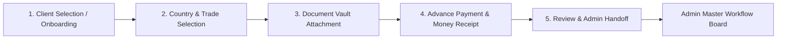

# Dynamic Role-Based Access Control (RBAC) & Workflow Architecture
**Monsur Ali Travels ERP — Client Dashboard (`dashboard/client`)**
**Document Reference:** `Docs/Dashboard/Arch/Dynamic_RBAC_and_Workflow_Architecture.md`
**Last Updated:** August 2026

---

## 1. Overview & Architectural Principles

The Client Dashboard (`dashboard/client`) serves multiple distinct staff roles (Frontdesk, Accountant, Visa Processor, Lawyer, Representative, etc.). To ensure modularity, security, and effortless scalability when adding or modifying staff roles, the system uses a **Centralized Dynamic Role Navigation & Permission Registry** (`src/configs/roleNavConfig.js`).

### Core Principles:
1. **Zero Hardcoding**: Sidebar items and route permissions are never hardcoded with static `if-else` blocks in UI components.
2. **Default Landing on "My Tasks"**: Staff members entering the dashboard do not land on a generic overview page. Instead, their landing page defaults to **My Tasks** (`/dashboard/agency/tasks`) to immediately display their assigned operational tasks.
3. **Admin Board Isolation**: The **Master Workflow Board** resides exclusively in the Admin Dashboard (`dashboard/admin`). Staff in `dashboard/client` only see their assigned tasks and submitted case entries.
4. **Declarative Role Presets**: Each role and sub-role is defined declaratively in `roleNavConfig.js`. Modifying or adding a role does not interfere with existing roles.

---

## 2. Role Access Matrix & Navigation Presets

| Role / Sub-Role | Default Landing | Permitted Navigation & Modules | Restricted Modules |
| :--- | :--- | :--- | :--- |
| **`Frontdesk`** | `My Tasks` | - **My Tasks** (`tasks`) - **Case Files** (`cases`) with 5-Step Creation Wizard - **Clients** (`clients-all`, `clients-add`) - **Document Studio** (Money Receipt, Client & Guardian Form, Passport Submission, Indian Visa, Agreement) - **Data Records** (Client Profiles, Agreements, Client Applications, Visas, Passports) | Admin Master Board, Case Approvals, Core Accounts (Invoices/Bills, Ledgers, Cash Vouchers, Payroll), System Settings. |
| **`Accountant`** | `My Tasks` | - **My Tasks** (`tasks`) - **Clients & Billing** (`clients-all`, `bills`, `payments`) - **Financial Document Studio** (Money Receipts, Cash Vouchers, Invoices, Monthly Salary Slips/Payroll) - **Financial Records** (Invoices, Salary Slips, Client Profiles) | Master Workflow Board, Visa Processing Tools, Admin Settings. |
| **`Visa_Processor`** | `My Tasks` | - **My Tasks** (`tasks`) - **Case Files** (`cases`) - **Visa & Passport Studio** (Indian Visa, Passport Submissions, Client Forms, Agreements) - **Processing Records** (Indian Visas, Passports, Client Applications) | Financial Ledgers, Billing/Invoicing, Cash Vouchers, Admin Settings. |
| **`Lawyer`** | `My Tasks` | - **My Tasks** (`tasks`) - **Legal Case Files** (`cases`) - **Legal Document Studio** (Agreements, Client Forms, Experience/Character/Marriage Certificates) - **Legal Records** (Agreements, Applications, Client Profiles) | Financial Accounts, Admin Settings. |
| **`Representative / ClientManager`** | `My Tasks` | - **My Tasks** (`tasks`) - **Case Files** (`cases`) - **Clients** (`clients-all`, `clients-add`) - **Document Studio** (Client Form, Money Receipt) | Core Accounts, Legal/Visa Tools, Admin Settings. |
| **`Owner / Admin / Manager`** | `My Tasks` | - **Full Unrestricted Access** across all modules and record centers. | None. |

---

## 3. 5-Step Case File Creation & Admin Handoff Workflow

When Frontdesk staff receives a candidate for an overseas case (e.g., Greece or Macedonia Work Permit), they execute the 5-step dynamic wizard in `CaseFileCreationModal.jsx`:

### Step Breakdown:
1. **Step 1: Client Selection or Instant Onboarding**
   - Live debounce search across existing records by Name, Phone, or Passport Number.
   - If client is new, inline entry for Candidate Name, Phone/WhatsApp, Passport Number, Email, and Address.
2. **Step 2: Destination Country & Case Details**
   - Destination options:
     - `Greece (Work Permit)` 🇬🇷
     - `Macedonia (Work Permit)` 🇲🇰
   - Applied Trade/Skill (e.g., General Worker, Construction, Agriculture, Driver, etc.).
   - Case Priority (`Normal`, `High`, `Urgent`) and Special Instructions.
3. **Step 3: Document Vault Uploads**
   - Multi-file drag-and-drop zone for:
     - Original Passport Scan Copy (PDF/JPG/PNG)
     - Candidate Passport Photograph (White background 35x45mm)
     - Additional Supporting Documents (NID, Police Clearance, Medical report)
4. **Step 4: Advance Payment & Money Receipt**
   - Total Package Agreed Amount (BDT) & Advance Received Amount (BDT).
   - Real-time calculation of remaining due balance.
   - Payment Method (`Cash`, `Bank Transfer`, `bKash`, `Nagad`).
   - Automated creation of **Money Receipt Voucher** (`MoneyReceiptPrintSlip.jsx`) with instant print trigger.
5. **Step 5: Review & Admin Handoff**
   - Comprehensive summary review card showing candidate details, destination program, attached files, and deposit.
   - Submits payload with `status: 'New'` $\rightarrow$ Triggers notification to Admin Master Workflow Board for processor/lawyer assignment.

---

## 4. Key Codebase Implementation References

- **Navigation & Role Registry**: [`src/configs/roleNavConfig.js`](file:///f:/Monsur%20Ali%20Travels/dashboard/client/src/configs/roleNavConfig.js)
  - `getNavGroupsForUser(user)`: Generates tailored menu structure per role.
  - `getDefaultSubmoduleForUser(user)`: Returns `'tasks'` as the landing page.
  - `isRouteAllowedForUser(user, portal, submodule)`: Declarative route guard.
- **Dynamic Sidebar**: [`src/components/layout/Sidebar.jsx`](file:///f:/Monsur%20Ali%20Travels/dashboard/client/src/components/layout/Sidebar.jsx)
  - Dynamically renders navigation groups, hides empty headers, and routes brand header click to `tasks`.
- **5-Step Case Creation Stepper**: [`src/components/agency/CaseFileCreationModal.jsx`](file:///f:/Monsur%20Ali%20Travels/dashboard/client/src/components/agency/CaseFileCreationModal.jsx)
- **Frontdesk & Staff Task Board**: [`src/pages/MyTasks.jsx`](file:///f:/Monsur%20Ali%20Travels/dashboard/client/src/pages/MyTasks.jsx) and [`src/components/tasks/TaskDoneModal.jsx`](file:///f:/Monsur%20Ali%20Travels/dashboard/client/src/components/tasks/TaskDoneModal.jsx)
- **Client Route Guarding**: [`src/pages/Agency.jsx`](file:///f:/Monsur%20Ali%20Travels/dashboard/client/src/pages/Agency.jsx)
